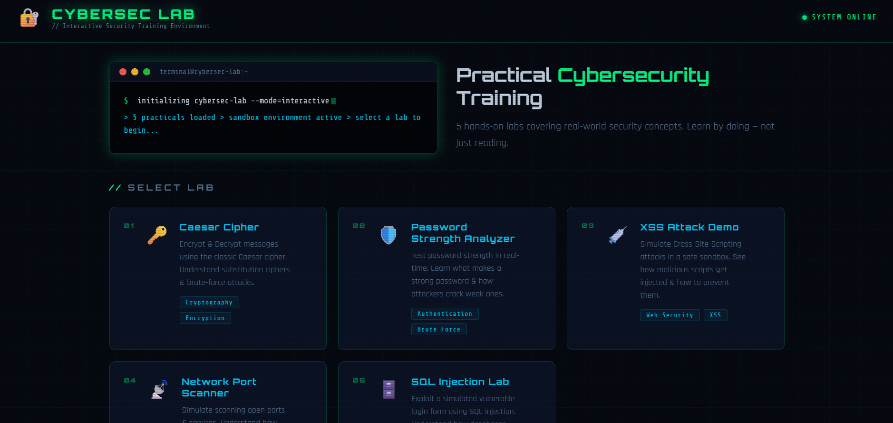

# 🔐 CYBERSEC LAB

> Interactive Security Training Environment for practical cybersecurity education.


## 📌 Overview

**CYBERSEC LAB** is a browser-based educational cybersecurity platform designed to provide hands-on learning through interactive security labs.

This project helps students, ethical hackers, and cybersecurity enthusiasts understand real-world security concepts by practicing in a safe sandboxed environment.

---

## 🚀 Features

- 🖥️ Modern cyber-themed interactive UI
- 🔐 5 practical security labs
- ⚡ Fully browser-based sandbox
- 📚 Educational and beginner-friendly
- 🛡️ Covers cryptography, web security, authentication, network scanning, and SQL injection

---

## 🧪 Included Labs

### 1️⃣ Caesar Cipher Lab
- Encrypt and decrypt messages
- Learn substitution cipher basics
- Understand brute-force attacks

### 2️⃣ Password Strength Analyzer
- Real-time password security analysis
- Learn secure password practices
- Understand password vulnerabilities

### 3️⃣ XSS Attack Demo
- Safe Cross-Site Scripting simulation
- Learn script injection methods
- Practice prevention techniques

### 4️⃣ Network Port Scanner
- Simulated network reconnaissance
- Learn open port detection
- Understand attack surface mapping

### 5️⃣ SQL Injection Lab
- Vulnerable login simulation
- Practice SQL injection techniques
- Learn database security defense

---

## 📂 Project Structure

```bash
CYBERSEC-LAB/
│
├── index.html
├── style.css
├── main.js
│
├── assets/
│   └── preview.png
│
└── practicals/
    ├── lab1-caesar-cipher.html
    ├── lab2-password-strength.html
    ├── lab3-xss-demo.html
    ├── lab4-network-scanner.html
    └── lab5-sql-injection.html
```
---
## 📸 Preview

<p align="center">
  
</p>
---
## 🌐 Live Demo

You can deploy this project on:

- GitHub Pages
- Netlify
- Vercel
- Render
---

## 📖 Learning Objectives

This project is ideal for:

- BCA / MCA students
- B.Tech CSE students
- University projects
- Educational portfolios

---
## 👨‍💻 Author

Yash Jain
---
## ⭐ Support

If you like this project:

- Star this repository
- Fork it
- Share with others
---
## 📜 License

This project is open-source and available for educational purposes.
---
